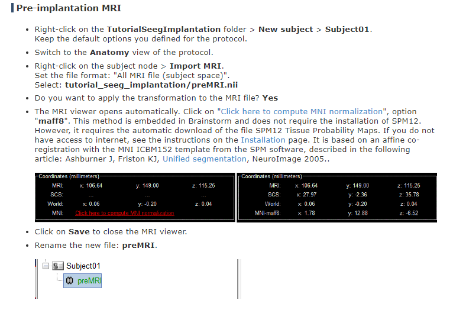

# Dicom to nii

Reference: https://blog.csdn.net/qianyunzzz/article/details/129928414

使用SPM12将DICOM格式转为nii格式文件

1.  更改路径： D:\MATLAB\spm12
2.  addpath('D:\MATLAB\spm12')
3.  在命令行窗口直接输入spm
    
4.  打开后选择fMRI（选PET/VBM也行）
   
5.  Dicom import
   
6.  Run △

# MR and CT to electrode

Reference: https://neuroimage.usc.edu/brainstorm/Tutorials/IeegContactLocalization 

1. MRI
   MNI normalization: segment
   
2. CT
   2.1   coregister效果不好的话，可以改用SPM
   
   
   2.2   如果CT整体颜色过浅会影响coregister结果
   下图颜色过浅
   
3. Generate isoSurface
   
   
4. Electrode labelling and contact localization
   
# Plot electrodes in common template
1. 显示电极
   
2. 修改背景画面颜色
   
3. 保存为图片
   
4. 